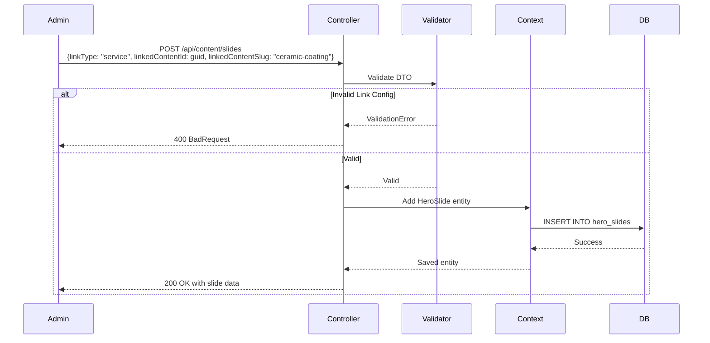
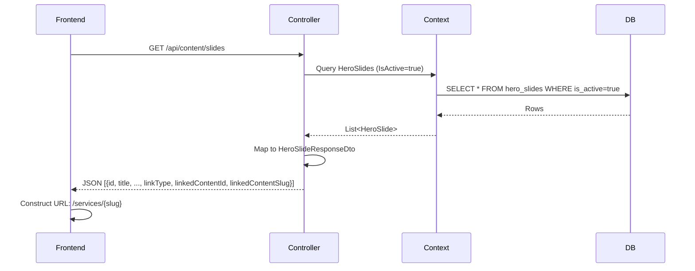

# Design Document: Banner Link to Detail

## Overview

This feature extends the existing HeroSlide banner system to support configurable navigation links to detail pages for Services, Products, and Posts. The design follows ASP.NET Core best practices with Entity Framework Core, maintaining the existing snake_case PostgreSQL naming convention and soft reference pattern (no foreign key constraints).

The solution adds three new fields to the `hero_slides` table to store link configuration, implements validation logic in the application layer, and extends the ContentController API to accept and return link data. The frontend can use the returned slug values to construct navigation URLs according to its routing scheme.

### Key Design Decisions

1. **Soft References**: No foreign key constraints between `hero_slides` and content tables (`services`, `products`, `posts`) to prevent cascade deletion and allow content deletion without breaking banners
2. **String-based LinkType**: Store enum as string in database for readability and flexibility
3. **Slug-based Navigation**: Store slug alongside ID to enable frontend URL construction without additional API calls
4. **Application-layer Validation**: Implement validation logic in DTOs and controller rather than database constraints for better error messages
5. **Backward Compatibility**: All new fields are optional in API requests; existing endpoints continue to function

## Architecture

### Component Overview

```
┌─────────────────────────────────────────────────────────────────┐
│                        Frontend Application                      │
│  - Fetches banners via GET /api/content/slides                  │
│  - Constructs URLs: /services/{slug}, /products/{slug}, etc.    │
│  - Handles null link configs by displaying non-clickable banners│
└───────────────────────┬─────────────────────────────────────────┘
                        │ HTTP/JSON
┌───────────────────────▼─────────────────────────────────────────┐
│                     ContentController                            │
│  - GET /api/content/slides (returns link config)               │
│  - POST /api/content/slides (accepts link config)              │
│  - PUT /api/content/slides/{id} (updates link config)          │
│  - Validates link configuration using HeroSlideDtoValidator     │
└───────────────────────┬─────────────────────────────────────────┘
                        │ EF Core
┌───────────────────────▼─────────────────────────────────────────┐
│                      AppDbContext                                │
│  - HeroSlides DbSet                                             │
│  - OnModelCreating: Configure snake_case columns                │
└───────────────────────┬─────────────────────────────────────────┘
                        │
┌───────────────────────▼─────────────────────────────────────────┐
│                   PostgreSQL Database                            │
│  ┌─────────────────────────────────────────────────────────┐   │
│  │ hero_slides                                             │   │
│  │ - id (int, PK)                                          │   │
│  │ - tag, title, description, image_url                    │   │
│  │ - sort_order, is_active, created_at                     │   │
│  │ - link_type (varchar(20), default 'None') ◄─── NEW     │   │
│  │ - linked_content_id (uuid, nullable) ◄───────── NEW     │   │
│  │ - linked_content_slug (varchar(150), nullable) ◄─ NEW   │   │
│  └─────────────────────────────────────────────────────────┘   │
│                                                                  │
│  No FK constraints to services/products/posts (soft reference)  │
└──────────────────────────────────────────────────────────────────┘
```

### Data Flow Diagrams

#### Create Banner with Link



#### Retrieve Banners with Link Info



## Components and Interfaces

### 1. HeroSlide Model Extension

**File:** `backend/Models/SiteContent.cs`

**Changes:**
- Add `LinkType` property (enum)
- Add `LinkedContentId` property (Guid?, nullable)
- Add `LinkedContentSlug` property (string?, nullable with MaxLength 150)

**Updated Model:**
```csharp
[Table("hero_slides")]
public class HeroSlide
{
    [Key]
    [Column("id")]
    public int Id { get; set; }

    // Existing fields...
    [Required]
    [MaxLength(100)]
    [Column("tag")]
    public string Tag { get; set; } = string.Empty;

    [Required]
    [MaxLength(200)]
    [Column("title")]
    public string Title { get; set; } = string.Empty;

    [Column("description")]
    public string Description { get; set; } = string.Empty;

    [Column("image_url")]
    public string ImageUrl { get; set; } = string.Empty;

    [Column("sort_order")]
    public int SortOrder { get; set; } = 0;

    [Column("is_active")]
    public bool IsActive { get; set; } = true;

    [Column("created_at")]
    public DateTime CreatedAt { get; set; } = DateTime.UtcNow;

    // NEW: Link configuration fields
    [Column("link_type")]
    [MaxLength(20)]
    public LinkType LinkType { get; set; } = LinkType.None;

    [Column("linked_content_id")]
    public Guid? LinkedContentId { get; set; }

    [Column("linked_content_slug")]
    [MaxLength(150)]
    public string? LinkedContentSlug { get; set; }
}

public enum LinkType
{
    None,
    Service,
    Product,
    Post
}
```

### 2. Database Migration

**File:** `backend/Migrations/{timestamp}_AddBannerLinkingFields.cs`

**Migration Up:**
```csharp
protected override void Up(MigrationBuilder migrationBuilder)
{
    migrationBuilder.AddColumn<string>(
        name: "link_type",
        table: "hero_slides",
        type: "character varying(20)",
        maxLength: 20,
        nullable: false,
        defaultValue: "None");

    migrationBuilder.AddColumn<Guid>(
        name: "linked_content_id",
        table: "hero_slides",
        type: "uuid",
        nullable: true);

    migrationBuilder.AddColumn<string>(
        name: "linked_content_slug",
        table: "hero_slides",
        type: "character varying(150)",
        maxLength: 150,
        nullable: true);
}
```

**Migration Down:**
```csharp
protected override void Down(MigrationBuilder migrationBuilder)
{
    migrationBuilder.DropColumn(name: "link_type", table: "hero_slides");
    migrationBuilder.DropColumn(name: "linked_content_id", table: "hero_slides");
    migrationBuilder.DropColumn(name: "linked_content_slug", table: "hero_slides");
}
```

### 3. DTOs for API Contract

**File:** `backend/DTOs/HeroSlideDtos.cs` (new file)

```csharp
namespace DetailingStore.Api.DTOs
{
    /// <summary>
    /// Request DTO for creating a hero slide
    /// </summary>
    public class CreateHeroSlideDto
    {
        public string? Tag { get; set; }
        public string? Title { get; set; }
        public string? Description { get; set; }
        public string? ImageUrl { get; set; }
        public int? SortOrder { get; set; }
        
        // Link configuration (optional)
        public string? LinkType { get; set; }  // "none", "service", "product", "post"
        public Guid? LinkedContentId { get; set; }
        public string? LinkedContentSlug { get; set; }
    }

    /// <summary>
    /// Request DTO for updating a hero slide
    /// </summary>
    public class UpdateHeroSlideDto
    {
        public string? Tag { get; set; }
        public string? Title { get; set; }
        public string? Description { get; set; }
        public string? ImageUrl { get; set; }
        public int? SortOrder { get; set; }
        
        // Link configuration (optional)
        public string? LinkType { get; set; }
        public Guid? LinkedContentId { get; set; }
        public string? LinkedContentSlug { get; set; }
    }

    /// <summary>
    /// Response DTO for hero slides (used in GET endpoints)
    /// </summary>
    public class HeroSlideResponseDto
    {
        public int Id { get; set; }
        public string Tag { get; set; } = string.Empty;
        public string Title { get; set; } = string.Empty;
        public string Description { get; set; } = string.Empty;
        public string ImageUrl { get; set; } = string.Empty;
        public int SortOrder { get; set; }
        public bool IsActive { get; set; }
        
        // Link configuration (always included, may be null)
        public string LinkType { get; set; } = "none";
        public Guid? LinkedContentId { get; set; }
        public string? LinkedContentSlug { get; set; }
    }
}
```

### 4. Validation Logic

**Location:** Implement in `ContentController` or create separate validator class

**Validation Rules:**

```csharp
public class HeroSlideLinkValidator
{
    public static (bool IsValid, string? ErrorMessage) ValidateLinkConfiguration(
        string? linkTypeStr,
        Guid? linkedContentId,
        string? linkedContentSlug)
    {
        // Parse LinkType from string (case-insensitive)
        if (string.IsNullOrWhiteSpace(linkTypeStr))
        {
            linkTypeStr = "none";
        }

        if (!Enum.TryParse<LinkType>(linkTypeStr, ignoreCase: true, out var linkType))
        {
            return (false, $"Invalid LinkType value: {linkTypeStr}. Must be one of: None, Service, Product, Post");
        }

        // Rule 1: If LinkType is None, LinkedContentId and Slug must be null
        if (linkType == LinkType.None)
        {
            if (linkedContentId.HasValue)
            {
                return (false, "LinkType must be specified when LinkedContentId is provided");
            }
            // Slug can be ignored if ID is null
            return (true, null);
        }

        // Rule 2: If LinkType is not None, LinkedContentId must be provided
        if (!linkedContentId.HasValue)
        {
            return (false, "LinkedContentId is required when LinkType is not None");
        }

        // Rule 3: If LinkType is not None, LinkedContentSlug must be provided
        if (string.IsNullOrWhiteSpace(linkedContentSlug))
        {
            return (false, "LinkedContentSlug is required when LinkType is not None");
        }

        // Rule 4: Validate slug format (lowercase, alphanumeric, hyphens only, no leading/trailing hyphen)
        var slugValidation = ValidateSlugFormat(linkedContentSlug);
        if (!slugValidation.IsValid)
        {
            return slugValidation;
        }

        return (true, null);
    }

    public static (bool IsValid, string? ErrorMessage) ValidateSlugFormat(string? slug)
    {
        if (string.IsNullOrWhiteSpace(slug))
        {
            return (false, "Slug cannot be empty");
        }

        if (slug.Length > 150)
        {
            return (false, "Slug must not exceed 150 characters");
        }

        // Check for valid characters: lowercase letters, numbers, hyphens
        if (!System.Text.RegularExpressions.Regex.IsMatch(slug, @"^[a-z0-9]+(-[a-z0-9]+)*$"))
        {
            return (false, "Slug must contain only lowercase letters, numbers, and hyphens, and cannot start or end with a hyphen");
        }

        return (true, null);
    }
}
```

### 5. ContentController Updates

**File:** `backend/Controllers/ContentController.cs`

**Changes Required:**

1. **Update GET /api/content/slides** to return link fields
2. **Update POST /api/content/slides** to accept and validate link fields
3. **Update PUT /api/content/slides/{id}** to accept and validate link fields

**Detailed Implementation:**

```csharp
// GET /api/content/slides - Updated response
[HttpGet("slides")]
public async Task<IActionResult> GetSlides()
{
    var slides = await _context.HeroSlides
        .Where(s => s.IsActive)
        .OrderBy(s => s.SortOrder)
        .Select(s => new HeroSlideResponseDto
        {
            Id = s.Id,
            Tag = s.Tag,
            Title = s.Title,
            Description = s.Description,
            ImageUrl = s.ImageUrl,
            SortOrder = s.SortOrder,
            IsActive = s.IsActive,
            LinkType = s.LinkType.ToString().ToLower(),
            LinkedContentId = s.LinkedContentId,
            LinkedContentSlug = s.LinkedContentSlug
        })
        .ToListAsync();

    return Ok(new { success = true, data = slides });
}

// POST /api/content/slides - Updated with validation
[HttpPost("slides")]
public async Task<IActionResult> CreateSlide([FromBody] CreateHeroSlideDto dto)
{
    if (string.IsNullOrWhiteSpace(dto.Title))
        return BadRequest(new { message = "Tiêu đề slide không được để trống." });

    // Validate link configuration
    var (isValid, errorMessage) = HeroSlideLinkValidator.ValidateLinkConfiguration(
        dto.LinkType,
        dto.LinkedContentId,
        dto.LinkedContentSlug
    );

    if (!isValid)
    {
        return BadRequest(new { message = errorMessage });
    }

    // Parse LinkType (default to None if not provided)
    var linkType = LinkType.None;
    if (!string.IsNullOrWhiteSpace(dto.LinkType))
    {
        Enum.TryParse<LinkType>(dto.LinkType, ignoreCase: true, out linkType);
    }

    var maxOrder = await _context.HeroSlides.AnyAsync()
        ? await _context.HeroSlides.MaxAsync(s => s.SortOrder)
        : -1;

    var slide = new HeroSlide
    {
        Tag = dto.Tag?.Trim() ?? "✨ Banner",
        Title = dto.Title.Trim(),
        Description = dto.Description?.Trim() ?? string.Empty,
        ImageUrl = dto.ImageUrl?.Trim() ?? string.Empty,
        SortOrder = maxOrder + 1,
        IsActive = true,
        CreatedAt = DateTime.UtcNow,
        LinkType = linkType,
        LinkedContentId = dto.LinkedContentId,
        LinkedContentSlug = dto.LinkedContentSlug?.Trim()
    };

    await _context.HeroSlides.AddAsync(slide);
    await _context.SaveChangesAsync();

    return Ok(new
    {
        success = true,
        data = new HeroSlideResponseDto
        {
            Id = slide.Id,
            Tag = slide.Tag,
            Title = slide.Title,
            Description = slide.Description,
            ImageUrl = slide.ImageUrl,
            SortOrder = slide.SortOrder,
            IsActive = slide.IsActive,
            LinkType = slide.LinkType.ToString().ToLower(),
            LinkedContentId = slide.LinkedContentId,
            LinkedContentSlug = slide.LinkedContentSlug
        },
        message = "Thêm slide thành công."
    });
}

// PUT /api/content/slides/{id} - Updated with validation
[HttpPut("slides/{id:int}")]
public async Task<IActionResult> UpdateSlide(int id, [FromBody] UpdateHeroSlideDto dto)
{
    var slide = await _context.HeroSlides.FindAsync(id);
    if (slide == null)
        return NotFound(new { message = "Không tìm thấy slide." });

    // Update basic fields (preserve existing values if not provided)
    if (!string.IsNullOrWhiteSpace(dto.Tag))
        slide.Tag = dto.Tag.Trim();
    if (!string.IsNullOrWhiteSpace(dto.Title))
        slide.Title = dto.Title.Trim();
    if (dto.Description != null)
        slide.Description = dto.Description.Trim();
    if (dto.ImageUrl != null)
        slide.ImageUrl = dto.ImageUrl.Trim();
    if (dto.SortOrder.HasValue)
        slide.SortOrder = dto.SortOrder.Value;

    // Handle link configuration update
    // If any link field is provided, validate the entire configuration
    bool linkFieldsProvided = dto.LinkType != null || 
                              dto.LinkedContentId.HasValue || 
                              dto.LinkedContentSlug != null;

    if (linkFieldsProvided)
    {
        // Use provided values or preserve existing values
        var linkTypeStr = dto.LinkType ?? slide.LinkType.ToString();
        var linkedContentId = dto.LinkedContentId ?? slide.LinkedContentId;
        var linkedContentSlug = dto.LinkedContentSlug ?? slide.LinkedContentSlug;

        // Validate the configuration
        var (isValid, errorMessage) = HeroSlideLinkValidator.ValidateLinkConfiguration(
            linkTypeStr,
            linkedContentId,
            linkedContentSlug
        );

        if (!isValid)
        {
            return BadRequest(new { message = errorMessage });
        }

        // Apply updates
        if (dto.LinkType != null)
        {
            Enum.TryParse<LinkType>(dto.LinkType, ignoreCase: true, out var parsedLinkType);
            slide.LinkType = parsedLinkType;
            
            // Special case: If changing to None, clear the linked content fields
            if (parsedLinkType == LinkType.None)
            {
                slide.LinkedContentId = null;
                slide.LinkedContentSlug = null;
            }
        }

        if (dto.LinkedContentId.HasValue)
            slide.LinkedContentId = dto.LinkedContentId;
        
        if (dto.LinkedContentSlug != null)
            slide.LinkedContentSlug = dto.LinkedContentSlug.Trim();
    }

    await _context.SaveChangesAsync();

    return Ok(new
    {
        success = true,
        data = new HeroSlideResponseDto
        {
            Id = slide.Id,
            Tag = slide.Tag,
            Title = slide.Title,
            Description = slide.Description,
            ImageUrl = slide.ImageUrl,
            SortOrder = slide.SortOrder,
            IsActive = slide.IsActive,
            LinkType = slide.LinkType.ToString().ToLower(),
            LinkedContentId = slide.LinkedContentId,
            LinkedContentSlug = slide.LinkedContentSlug
        },
        message = "Cập nhật slide thành công."
    });
}
```

## Data Models

### Entity Relationship Overview

```
┌─────────────────────────────────────────┐
│         hero_slides                     │
│  - id (PK)                              │
│  - tag, title, description              │
│  - image_url, sort_order                │
│  - is_active, created_at                │
│  - link_type (enum as string)           │
│  - linked_content_id (uuid, nullable) ──┼──┐ (soft reference, no FK)
│  - linked_content_slug (varchar(150))   │  │
└─────────────────────────────────────────┘  │
                                             │
     ┌───────────────────────────────────────┼───────────────────────────────┐
     │                                       │                               │
     ▼                                       ▼                               ▼
┌─────────────┐                    ┌──────────────┐                ┌─────────────┐
│  services   │                    │   products   │                │    posts    │
│  - id (PK)  │                    │   - id (PK)  │                │  - id (PK)  │
│  - slug     │                    │   - slug     │                │  - slug     │
│  - name     │                    │   - name     │                │  - title    │
│  ...        │                    │   ...        │                │  ...        │
└─────────────┘                    └──────────────┘                └─────────────┘

Note: No foreign key constraints - allows content deletion without affecting banners
```

### Database Schema Changes

**Table:** `hero_slides`

| Column Name         | Type          | Nullable | Default | Description                                    |
|---------------------|---------------|----------|---------|------------------------------------------------|
| id                  | integer       | NO       | -       | Primary key                                    |
| tag                 | varchar(100)  | NO       | -       | Existing: category tag                         |
| title               | varchar(200)  | NO       | -       | Existing: slide title                          |
| description         | text          | NO       | ''      | Existing: slide description                    |
| image_url           | text          | NO       | ''      | Existing: banner image URL                     |
| sort_order          | integer       | NO       | 0       | Existing: display order                        |
| is_active           | boolean       | NO       | true    | Existing: visibility flag                      |
| created_at          | timestamp     | NO       | NOW()   | Existing: creation timestamp                   |
| **link_type**       | varchar(20)   | NO       | 'None'  | **NEW:** Enum value (None/Service/Product/Post)|
| **linked_content_id**| uuid         | YES      | NULL    | **NEW:** ID of linked content item             |
| **linked_content_slug**| varchar(150)| YES    | NULL    | **NEW:** Slug for URL construction             |

### LinkType Enum Definition

```csharp
public enum LinkType
{
    None,      // No link - banner is display-only
    Service,   // Links to /services/{slug}
    Product,   // Links to /products/{slug}
    Post       // Links to /posts/{slug}
}
```

**Database Storage:** String representation (e.g., "None", "Service")
**JSON Serialization:** Lowercase (e.g., "none", "service")

### Validation Constraints

| Field               | Constraint                                           |
|---------------------|------------------------------------------------------|
| link_type           | Must be one of: None, Service, Product, Post         |
| linked_content_id   | Required if link_type ≠ None, NULL if link_type = None |
| linked_content_slug | Required if link_type ≠ None, NULL if link_type = None |
| linked_content_slug | Max length: 150 characters                           |
| linked_content_slug | Pattern: `^[a-z0-9]+(-[a-z0-9]+)*$`                  |

## Error Handling

### Validation Errors

**Error Response Format:**
```json
{
  "message": "Error description in Vietnamese for user display",
  "field": "fieldName",
  "code": "VALIDATION_ERROR"
}
```

**Error Scenarios:**

| Scenario | HTTP Status | Error Message |
|----------|-------------|---------------|
| LinkType invalid | 400 | "Loại liên kết không hợp lệ. Phải là: None, Service, Product, hoặc Post" |
| LinkedContentId null when LinkType ≠ None | 400 | "ID nội dung là bắt buộc khi loại liên kết không phải None" |
| LinkedContentSlug null when LinkType ≠ None | 400 | "Slug nội dung là bắt buộc khi loại liên kết không phải None" |
| LinkedContentId provided but LinkType = None | 400 | "Phải chỉ định loại liên kết khi cung cấp ID nội dung" |
| Slug exceeds 150 characters | 400 | "Slug không được vượt quá 150 ký tự" |
| Slug contains invalid characters | 400 | "Slug chỉ được chứa chữ thường, số, và dấu gạch ngang" |
| Slug starts/ends with hyphen | 400 | "Slug không được bắt đầu hoặc kết thúc bằng dấu gạch ngang" |

### Runtime Error Handling

#### Content Deletion Handling

**Scenario:** Linked content (Service/Product/Post) is deleted from database

**System Behavior:**
1. Banner record remains intact (no cascade delete)
2. GET /api/content/slides continues to return the banner with link fields
3. Frontend receives linkType, linkedContentId, and linkedContentSlug
4. Frontend attempts navigation to `/services/{slug}` (or equivalent)
5. Detail page API returns 404
6. Frontend displays "Nội dung không tồn tại" error page

**Optional Enhancement (Future):**
- Add validation endpoint: `GET /api/content/slides/{id}/validate-link`
- Returns: `{ isValid: boolean, exists: boolean, contentTitle: string }`
- Admin UI can periodically check and display warnings for broken links

#### Database Connection Errors

**Scenario:** Database unavailable during slide retrieval

**System Behavior:**
```csharp
try
{
    var slides = await _context.HeroSlides.ToListAsync();
    return Ok(new { success = true, data = slides });
}
catch (Exception ex)
{
    _logger.LogError(ex, "Failed to retrieve hero slides");
    return StatusCode(500, new
    {
        success = false,
        message = "Lỗi khi tải danh sách banner. Vui lòng thử lại sau."
    });
}
```

### Frontend Error Handling

**Link Construction Safety:**

```typescript
function constructBannerLink(slide: HeroSlideResponseDto): string | null {
  if (slide.linkType === 'none') {
    return null;
  }

  if (!slide.linkedContentSlug) {
    console.error(`Banner ${slide.id} has linkType ${slide.linkType} but missing slug`);
    return null;
  }

  const linkMap = {
    service: `/services/${slide.linkedContentSlug}`,
    product: `/products/${slide.linkedContentSlug}`,
    post: `/posts/${slide.linkedContentSlug}`,
  };

  return linkMap[slide.linkType] || null;
}
```

## Testing Strategy

### Unit Testing

**Test Categories:**

1. **Validation Logic Tests**
   - Test `HeroSlideLinkValidator.ValidateLinkConfiguration()` with all combinations:
     - LinkType=None, ID=null, Slug=null → Valid
     - LinkType=None, ID=provided, Slug=null → Invalid
     - LinkType=Service, ID=null, Slug=provided → Invalid
     - LinkType=Service, ID=provided, Slug=null → Invalid
     - LinkType=Service, ID=provided, Slug=valid → Valid
   
2. **Slug Format Validation Tests**
   - Valid slugs: "ceramic-coating", "premium-wax-service", "product-123"
   - Invalid slugs: "Ceramic-Coating" (uppercase), "-ceramic", "ceramic-", "ceramic--coating", "ceramic_coating", "ceramic coating"
   - Edge cases: 150-character slug (valid), 151-character slug (invalid), empty string, null

3. **Controller Tests**
   - Test POST endpoint with valid link config → 200 OK
   - Test POST endpoint with invalid link config → 400 BadRequest
   - Test PUT endpoint updating from None to Service → validates required fields
   - Test PUT endpoint updating from Service to None → clears linked fields
   - Test GET endpoint returns all link fields correctly

### Integration Testing

**Test Scenarios:**

1. **End-to-End Slide Creation**
   - Create service via POST /api/services → get service.id and service.slug
   - Create banner via POST /api/content/slides with linkType=service, link service
   - Retrieve banners via GET /api/content/slides
   - Verify link fields are returned correctly

2. **Content Deletion Handling**
   - Create banner linked to a product
   - Delete the product via DELETE /api/products/{id}
   - Retrieve banners via GET /api/content/slides
   - Verify banner still exists with link fields intact
   - Attempt to navigate to product detail → expect 404

3. **Backward Compatibility**
   - Create banner without link fields (legacy behavior)
   - Verify linkType defaults to "none"
   - Verify GET response includes link fields as null

### Manual Testing Checklist

- [ ] Admin creates banner with link to service → frontend navigates correctly
- [ ] Admin creates banner with link to product → frontend navigates correctly
- [ ] Admin creates banner with link to post → frontend navigates correctly
- [ ] Admin creates banner without link → frontend displays non-clickable banner
- [ ] Admin updates existing banner to add link → link works after update
- [ ] Admin updates banner to remove link (change to None) → banner becomes non-clickable
- [ ] Admin provides invalid slug format → receives clear error message
- [ ] Delete linked content → banner still displays, navigation fails gracefully
- [ ] Existing banners (created before feature) → continue to display correctly

### Property-Based Testing Assessment

**PBT Applicability:** This feature is NOT suitable for property-based testing because:

1. **Infrastructure/Database Layer:** The core functionality involves database schema changes and EF Core migrations, which are infrastructure concerns better tested with example-based integration tests and snapshot tests of the generated SQL.

2. **API CRUD Operations:** The controller endpoints are straightforward CRUD operations with validation logic. These are more effectively tested with example-based unit tests covering specific validation scenarios.

3. **Validation Rules Are Discrete:** The validation logic has specific business rules (e.g., "if LinkType is None, ID must be null") that are best verified with concrete examples rather than random input generation.

4. **UI Integration:** The feature includes frontend routing behavior that requires integration testing with specific examples (e.g., does `/services/ceramic-coating` route correctly?).

**Testing Approach:**
- Use **example-based unit tests** for validation logic (covering all branches)
- Use **integration tests** for database operations (create, update, retrieve with link data)
- Use **manual testing** for frontend navigation and error handling
- Use **snapshot tests** for migration SQL generation

## Implementation Plan

### Phase 1: Database and Model Changes
1. Create LinkType enum in `Models/SiteContent.cs`
2. Add three new properties to HeroSlide model
3. Create EF Core migration: `Add-Migration AddBannerLinkingFields`
4. Review generated migration SQL
5. Apply migration: `Update-Database`

### Phase 2: DTOs and Validation
1. Create `DTOs/HeroSlideDtos.cs` with CreateHeroSlideDto, UpdateHeroSlideDto, HeroSlideResponseDto
2. Create `Validators/HeroSlideLinkValidator.cs` with validation logic
3. Write unit tests for validation logic

### Phase 3: Controller Updates
1. Update GET /api/content/slides to return link fields
2. Update POST /api/content/slides to accept and validate link fields
3. Update PUT /api/content/slides/{id} to accept and validate link fields
4. Remove old CreateHeroSlideDto from ContentController.cs (move to DTOs file)

### Phase 4: Testing
1. Write unit tests for validator
2. Write integration tests for controller endpoints
3. Perform manual testing with Postman/HTTP files

### Phase 5: Frontend Integration (Out of Scope for Backend Design)
1. Update TypeScript types for HeroSlideResponseDto
2. Implement link construction logic
3. Handle null link configurations (non-clickable banners)
4. Handle 404 errors when navigating to deleted content

## Backward Compatibility Notes

### Existing API Clients

**GET /api/content/slides:**
- Old response: `{ id, tag, title, description, imageUrl, sortOrder, isActive }`
- New response: Adds `linkType`, `linkedContentId`, `linkedContentSlug`
- Impact: Frontend must handle new fields (can ignore if not using feature)

**POST /api/content/slides:**
- Old request: `{ tag, title, description, imageUrl, sortOrder }`
- New request: Optionally accepts `linkType`, `linkedContentId`, `linkedContentSlug`
- Impact: Existing requests continue to work (link fields default to None/null)

**PUT /api/content/slides/{id}:**
- Old request: `{ tag, title, description, imageUrl, sortOrder }`
- New request: Optionally accepts link fields
- Impact: Partial updates work as before; link fields preserved if not specified

### Database Migration Safety

- Migration adds columns with default values (link_type = 'None')
- Existing rows automatically get default values
- No data loss or breaking changes
- Migration can be rolled back safely (Drop columns)

## Security Considerations

### Input Validation

1. **Slug Injection Prevention:** Regex validation prevents path traversal attacks (no `../` patterns possible)
2. **SQL Injection:** EF Core parameterized queries protect against SQL injection
3. **XSS Protection:** Slug values are URL-encoded when constructing frontend routes

### Authorization

- POST /api/content/slides: Requires Admin role (existing auth middleware)
- PUT /api/content/slides/{id}: Requires Admin role
- GET /api/content/slides: Public endpoint (no auth required)

### No Foreign Key Constraints

**Rationale:** Soft references prevent cascade deletion issues:
- Admin can delete a service without breaking banners
- Banners remain visible even when content is deleted
- Frontend handles missing content gracefully

**Trade-off:** No referential integrity at database level
- Application layer must validate content existence (optional enhancement)
- Admin UI should provide warnings for broken links (future feature)

## Performance Considerations

### Database Query Optimization

**GET /api/content/slides:**
- Query: `SELECT * FROM hero_slides WHERE is_active = true ORDER BY sort_order`
- Index: Existing index on `is_active` and `sort_order` covers this query
- No joins required (soft references)
- Performance: Sub-millisecond query time for typical dataset (< 20 slides)

### API Response Size

**Impact of New Fields:**
- linkType: ~10 bytes (string)
- linkedContentId: 36 bytes (UUID as string)
- linkedContentSlug: Variable, max 150 bytes
- Total per slide: ~200 bytes additional data
- For 10 slides: ~2KB additional response size

**Conclusion:** Negligible impact on API response time and bandwidth

### Frontend Rendering

**Link Construction:**
- Simple string interpolation: `/services/${slug}`
- No additional API calls required
- Slug already provided in slide data

## Future Enhancements

### Link Validation Endpoint

```
GET /api/content/slides/{id}/validate-link
Response: {
  isValid: boolean,
  exists: boolean,
  contentTitle: string,
  contentType: string
}
```

### Admin UI Link Picker

- Dropdown to select LinkType
- Autocomplete to search and select content by title
- Auto-populate LinkedContentId and LinkedContentSlug
- Display warnings for broken links (content deleted)

### Analytics Integration

- Track banner click-through rates by link type
- Identify popular linked content
- Detect and report broken links

### External Link Support

- Add LinkType.External
- Add ExternalUrl field
- Validate URL format
- Display external link icon in UI

