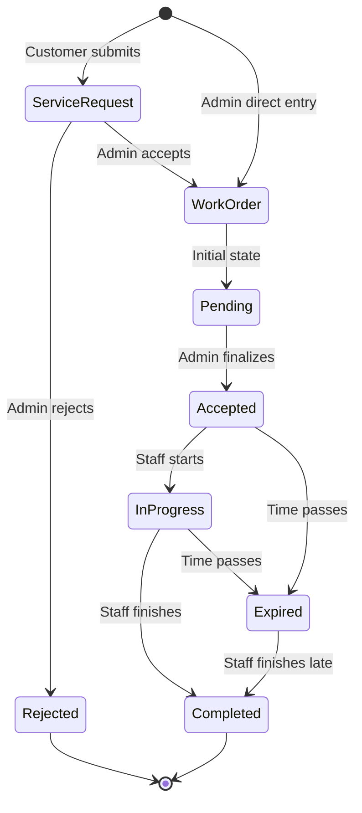
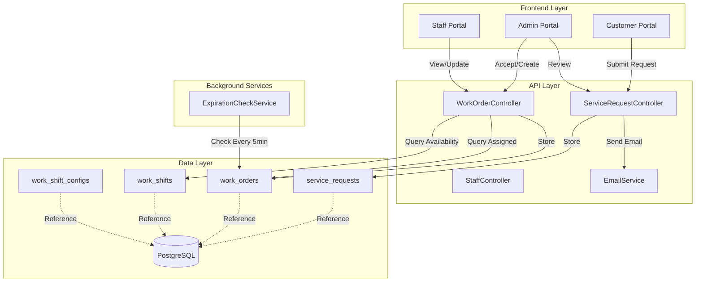
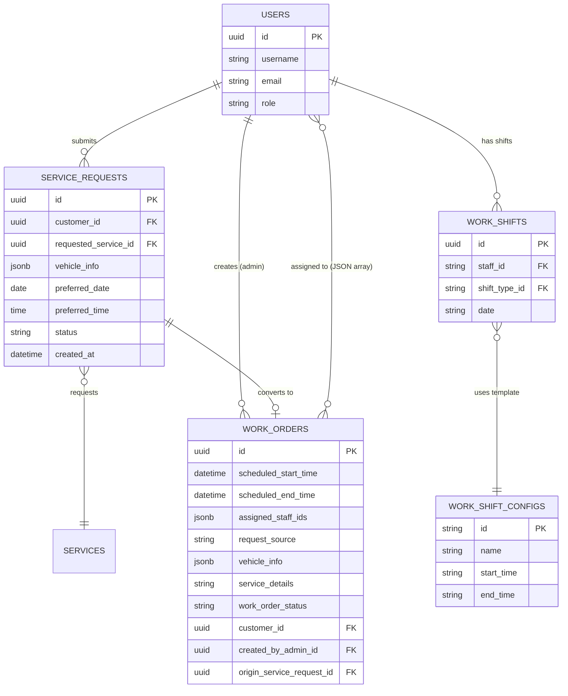

# Design Document: Service Request & Work Order Management System

## Overview

The Service Request & Work Order Management System is a comprehensive workflow management solution that bridges customer service requests with staff work assignments. The system consists of three primary user flows:

1. **Customer Flow**: Authenticated customers submit service requests through a web form, receive automated email confirmations, and wait for admin review
2. **Admin Flow**: Administrators review incoming service requests, accept/reject them with scheduling and staff assignment, or create direct work orders for walk-in customers
3. **Staff Flow**: Assigned staff members view their work orders, update status as work progresses, and complete tasks

### Core Design Principles

- **Single Source of Truth**: All work (whether from customer requests or direct entry) flows through the unified WorkOrder entity
- **Time-Based Staff Filtering**: Staff assignment is always filtered by work shift availability during the scheduled work order time period
- **Separation of Concerns**: ServiceRequest entities capture initial customer submissions; WorkOrder entities represent actionable scheduled work
- **Asynchronous Communication**: Email notifications decouple customer submission from admin processing
- **Role-Based Access**: Customers see only their requests, staff see only assigned work orders, admins see everything

### Key Workflow States



## Architecture

### System Architecture Diagram



### Technology Stack

**Backend:**
- ASP.NET Core 9.0
- Entity Framework Core with PostgreSQL
- SMTP Email Service (existing configuration)
- Background service for expiration checks (IHostedService or Hangfire)

**Frontend:**
- React 18 with TypeScript
- Redux Toolkit for state management
- Custom CSS (no Tailwind per project standards)
- Axios for API communication

**Database:**
- PostgreSQL with snake_case naming convention
- EF Core migrations for schema management

### API Layer Architecture

The API follows RESTful principles with controller-based routing:

- **ServiceRequestsController**: Handles customer submissions and admin review
- **WorkOrdersController**: Manages work order creation, retrieval, and status updates
- **StaffController**: Provides staff availability queries based on work shifts
- **EmailService**: Injectable service for sending confirmation emails

### Background Services

**WorkOrderExpirationService** (IHostedService):
- Runs every 5 minutes
- Queries work orders where `scheduled_end_time < NOW() AND work_order_status NOT IN ('completed', 'expired', 'rejected')`
- Updates status to `expired`
- Logs expiration events

## Components and Interfaces

### Backend Components

#### 1. Data Models

**ServiceRequest Entity** (`service_requests` table):
```csharp
public class ServiceRequestEntity
{
    public Guid Id { get; set; }
    public Guid CustomerId { get; set; }
    public string CustomerName { get; set; }
    public string CustomerEmail { get; set; }
    public string CustomerPhone { get; set; }
    public string VehicleInfo { get; set; } // JSON: {licensePlate, model, year}
    public Guid RequestedServiceId { get; set; }
    public DateOnly PreferredDate { get; set; }
    public TimeOnly PreferredTime { get; set; }
    public string? CustomerNotes { get; set; }
    public ServiceRequestStatus Status { get; set; } // Pending, Accepted, Rejected
    public DateTime CreatedAt { get; set; }
    public DateTime? ReviewedAt { get; set; }
    public Guid? ReviewedByAdminId { get; set; }
    
    // Navigation properties
    public User Customer { get; set; }
    public ServiceEntity RequestedService { get; set; }
    public User? ReviewedByAdmin { get; set; }
}

public enum ServiceRequestStatus
{
    Pending,
    Accepted,
    Rejected
}
```

**WorkOrder Entity** (`work_orders` table):
```csharp
public class WorkOrderEntity
{
    public Guid Id { get; set; }
    public DateTime ScheduledStartTime { get; set; }
    public DateTime ScheduledEndTime { get; set; }
    public string AssignedStaffIds { get; set; } // JSON array: ["guid1","guid2"]
    public RequestSource RequestSource { get; set; }
    public string VehicleInfo { get; set; } // JSON: {licensePlate, model, year}
    public string ServiceDetails { get; set; } // Text description
    public WorkOrderStatus WorkOrderStatus { get; set; }
    
    // Optional customer information
    public Guid? CustomerId { get; set; }
    public string? CustomerName { get; set; }
    public string? CustomerPhone { get; set; }
    public string? CustomerEmail { get; set; }
    
    // Admin fields
    public decimal? PriceQuote { get; set; }
    public string? AdminNotes { get; set; }
    public Guid CreatedByAdminId { get; set; }
    
    // Timestamps
    public DateTime CreatedAt { get; set; }
    public DateTime? CompletedAt { get; set; }
    
    // Navigation properties
    public User? Customer { get; set; }
    public User CreatedByAdmin { get; set; }
    public Guid? OriginServiceRequestId { get; set; } // Link back to service request if applicable
    public ServiceRequestEntity? OriginServiceRequest { get; set; }
}

public enum RequestSource
{
    CustomerRequest,
    DirectEntry
}

public enum WorkOrderStatus
{
    Pending,
    Accepted,
    Rejected,
    InProgress,
    Completed,
    Expired
}
```

**Existing WorkShift Models** (already in codebase):
- `WorkShiftEntity`: Represents individual staff shift assignments (staff_id, shift_type_id, date)
- `WorkShiftConfigEntity`: Defines shift templates (id, name, start_time, end_time)

#### 2. API Endpoints

**ServiceRequestsController**:
```csharp
[ApiController]
[Route("api/service-requests")]
public class ServiceRequestsController : ControllerBase
{
    // POST api/service-requests
    // Customer submits a service request
    [HttpPost]
    [Authorize(Roles = "Customer")]
    public async Task<ActionResult<ApiResponse<ServiceRequestDto>>> CreateServiceRequest(
        CreateServiceRequestDto dto)
    {
        // 1. Validate customer ID matches authenticated user
        // 2. Create ServiceRequestEntity with Status = Pending
        // 3. Save to database
        // 4. Trigger email service (fire and forget)
        // 5. Return created entity
    }
    
    // GET api/service-requests
    // Admin retrieves all service requests
    [HttpGet]
    [Authorize(Roles = "Admin")]
    public async Task<ActionResult<ApiResponse<List<ServiceRequestDto>>>> GetServiceRequests(
        [FromQuery] ServiceRequestStatus? status = null)
    {
        // 1. Query service_requests with optional status filter
        // 2. Include related entities (Customer, RequestedService)
        // 3. Order by CreatedAt descending
        // 4. Return list
    }
    
    // GET api/service-requests/{id}
    // Admin retrieves single service request details
    [HttpGet("{id}")]
    [Authorize(Roles = "Admin")]
    public async Task<ActionResult<ApiResponse<ServiceRequestDetailDto>>> GetServiceRequestById(
        Guid id)
    {
        // 1. Query service_requests by ID
        // 2. Include all related data
        // 3. Return detailed DTO
    }
    
    // PUT api/service-requests/{id}/accept
    // Admin accepts service request and creates work order
    [HttpPut("{id}/accept")]
    [Authorize(Roles = "Admin")]
    public async Task<ActionResult<ApiResponse<WorkOrderDto>>> AcceptServiceRequest(
        Guid id,
        AcceptServiceRequestDto dto)
    {
        // 1. Load ServiceRequest by ID
        // 2. Validate status is Pending
        // 3. Create WorkOrderEntity with RequestSource = CustomerRequest
        // 4. Copy customer info from service request
        // 5. Set scheduling, price, notes from dto
        // 6. Parse and validate assigned_staff_ids from dto
        // 7. Update ServiceRequest.Status = Accepted
        // 8. Save both entities in transaction
        // 9. Return created WorkOrder
    }
    
    // PUT api/service-requests/{id}/reject
    // Admin rejects service request
    [HttpPut("{id}/reject")]
    [Authorize(Roles = "Admin")]
    public async Task<ActionResult<ApiResponse<ServiceRequestDto>>> RejectServiceRequest(
        Guid id)
    {
        // 1. Load ServiceRequest by ID
        // 2. Validate status is Pending
        // 3. Update Status = Rejected, ReviewedAt = NOW(), ReviewedByAdminId
        // 4. Save changes
        // 5. Return updated entity
    }
}
```

**WorkOrdersController**:
```csharp
[ApiController]
[Route("api/work-orders")]
public class WorkOrdersController : ControllerBase
{
    // POST api/work-orders
    // Admin creates work order directly
    [HttpPost]
    [Authorize(Roles = "Admin")]
    public async Task<ActionResult<ApiResponse<WorkOrderDto>>> CreateWorkOrder(
        CreateWorkOrderDto dto)
    {
        // 1. Validate scheduled times (end > start)
        // 2. Create WorkOrderEntity with RequestSource = DirectEntry
        // 3. Set CreatedByAdminId from authenticated user
        // 4. Parse assigned_staff_ids from dto
        // 5. Set optional customer fields if provided
        // 6. Save to database
        // 7. Return created entity
    }
    
    // GET api/work-orders
    // Retrieve work orders with role-based filtering
    [HttpGet]
    [Authorize]
    public async Task<ActionResult<ApiResponse<List<WorkOrderDto>>>> GetWorkOrders(
        [FromQuery] Guid? staffId = null,
        [FromQuery] WorkOrderStatus? status = null,
        [FromQuery] DateOnly? date = null)
    {
        // 1. If user is Staff: filter where assigned_staff_ids contains user ID
        // 2. If user is Admin: apply query filters (staffId, status, date)
        // 3. Order by ScheduledStartTime ascending
        // 4. Include related entities
        // 5. Return list
    }
    
    // GET api/work-orders/{id}
    // Retrieve single work order details
    [HttpGet("{id}")]
    [Authorize]
    public async Task<ActionResult<ApiResponse<WorkOrderDetailDto>>> GetWorkOrderById(
        Guid id)
    {
        // 1. Load work order by ID
        // 2. If user is Staff: validate user ID in assigned_staff_ids
        // 3. If user is Admin: allow access
        // 4. Return detailed DTO with all fields
    }
    
    // PUT api/work-orders/{id}/status
    // Update work order status (staff and admin)
    [HttpPut("{id}/status")]
    [Authorize]
    public async Task<ActionResult<ApiResponse<WorkOrderDto>>> UpdateWorkOrderStatus(
        Guid id,
        UpdateWorkOrderStatusDto dto)
    {
        // 1. Load work order by ID
        // 2. If user is Staff: validate user ID in assigned_staff_ids
        // 3. Validate status transition (e.g., Accepted -> InProgress -> Completed)
        // 4. Update WorkOrderStatus
        // 5. If new status is Completed: set CompletedAt = NOW()
        // 6. Save changes
        // 7. Return updated entity
    }
}
```

**StaffController** (extend existing or create new endpoint):
```csharp
[ApiController]
[Route("api/staff")]
public class StaffController : ControllerBase
{
    // GET api/staff/available?start_time=2026-01-15T07:30:00&end_time=2026-01-15T11:00:00
    // Query available staff based on work shift overlap
    [HttpGet("available")]
    [Authorize(Roles = "Admin")]
    public async Task<ActionResult<ApiResponse<List<AvailableStaffDto>>>> GetAvailableStaff(
        [FromQuery] DateTime startTime,
        [FromQuery] DateTime endTime)
    {
        // 1. Validate endTime > startTime
        // 2. Extract date from startTime (YYYY-MM-DD)
        // 3. Query work_shifts WHERE Date = extracted_date
        // 4. For each shift, load WorkShiftConfig to get shift start/end times
        // 5. Calculate shift absolute times (combine date + shift time)
        // 6. Filter shifts where shift_start < work_order_end AND shift_end > work_order_start
        // 7. Get distinct staff IDs from matching shifts
        // 8. Load User entities for those staff IDs
        // 9. Return list of staff with their shift info
    }
}
```

#### 3. Service Interfaces

**IEmailService**:
```csharp
public interface IEmailService
{
    Task<bool> SendServiceRequestConfirmationAsync(
        string recipientEmail,
        string customerName,
        ServiceRequestDto requestDetails);
}

public class EmailService : IEmailService
{
    private readonly IConfiguration _configuration;
    private readonly ILogger<EmailService> _logger;
    
    public async Task<bool> SendServiceRequestConfirmationAsync(
        string recipientEmail,
        string customerName,
        ServiceRequestDto requestDetails)
    {
        try
        {
            // 1. Load SMTP settings from configuration
            // 2. Build email HTML template with:
            //    - "Thank you for your service request..."
            //    - Vehicle info, service, preferred date/time
            //    - Contact information
            // 3. Send via SmtpClient
            // 4. Return true on success
        }
        catch (Exception ex)
        {
            // Log error but don't throw (non-blocking)
            _logger.LogError(ex, "Failed to send confirmation email");
            return false;
        }
    }
}
```

**IWorkOrderExpirationService**:
```csharp
public interface IWorkOrderExpirationService : IHostedService
{
    // Background service interface - no additional methods needed
}

public class WorkOrderExpirationService : BackgroundService
{
    private readonly IServiceProvider _serviceProvider;
    private readonly ILogger<WorkOrderExpirationService> _logger;
    
    protected override async Task ExecuteAsync(CancellationToken stoppingToken)
    {
        while (!stoppingToken.IsCancellationRequested)
        {
            try
            {
                using var scope = _serviceProvider.CreateScope();
                var dbContext = scope.ServiceProvider.GetRequiredService<AppDbContext>();
                
                // 1. Query work orders where:
                //    scheduled_end_time < NOW()
                //    AND work_order_status IN ('pending', 'accepted', 'in_progress')
                var expiredOrders = await dbContext.WorkOrders
                    .Where(wo => wo.ScheduledEndTime < DateTime.UtcNow
                        && (wo.WorkOrderStatus == WorkOrderStatus.Pending
                            || wo.WorkOrderStatus == WorkOrderStatus.Accepted
                            || wo.WorkOrderStatus == WorkOrderStatus.InProgress))
                    .ToListAsync(stoppingToken);
                
                // 2. Update each to Expired
                foreach (var order in expiredOrders)
                {
                    order.WorkOrderStatus = WorkOrderStatus.Expired;
                    _logger.LogInformation($"Work order {order.Id} expired");
                }
                
                // 3. Save changes
                await dbContext.SaveChangesAsync(stoppingToken);
            }
            catch (Exception ex)
            {
                _logger.LogError(ex, "Error checking for expired work orders");
            }
            
            // Wait 5 minutes before next check
            await Task.Delay(TimeSpan.FromMinutes(5), stoppingToken);
        }
    }
}
```

### Frontend Components

#### Customer Portal Components

**ServiceRequestForm.tsx**:
```typescript
interface ServiceRequestFormProps {
    customerId: string;
    onSubmitSuccess: () => void;
}

// Form fields:
// - Vehicle Info: License Plate, Model, Year (grouped inputs)
// - Service Selection: Dropdown from available services
// - Preferred Date: Date picker
// - Preferred Time: Time picker
// - Notes: Textarea (optional)

// Submission flow:
// 1. Validate all required fields
// 2. POST /api/service-requests
// 3. Show success message: "Request submitted! Check your email for confirmation."
// 4. Reset form
// 5. Call onSubmitSuccess callback
```

**ServiceRequestsList.tsx** (for customer to view their own requests):
```typescript
interface ServiceRequestsListProps {
    customerId: string;
}

// Display:
// - List of customer's service requests
// - Each card shows: date, service name, status badge, vehicle info
// - Color-coded status: Pending (yellow), Accepted (green), Rejected (red)
// - Filter by status
```

#### Admin Portal Components

**AdminServiceRequestsList.tsx**:
```typescript
interface AdminServiceRequestsListProps {
    onSelectRequest: (requestId: string) => void;
}

// Display:
// - Table or card grid of all service requests
// - Columns: Created Date, Customer Name, Service, Preferred Time, Status
// - Filter by status (default: show only Pending)
// - Sort by date (newest first)
// - Click row to open detail modal
```

**ServiceRequestDetailModal.tsx**:
```typescript
interface ServiceRequestDetailModalProps {
    requestId: string;
    onClose: () => void;
    onAccept: () => void;
    onReject: () => void;
}

// Display sections:
// - Customer Information: Name, Email, Phone
// - Vehicle Information: License Plate, Model, Year
// - Service Details: Requested service name, preferred date/time
// - Customer Notes: Display text

// Action buttons:
// - Accept: Opens AcceptServiceRequestForm
// - Reject: Confirms rejection, calls PUT /api/service-requests/{id}/reject
// - Close: Closes modal
```

**AcceptServiceRequestForm.tsx**:
```typescript
interface AcceptServiceRequestFormProps {
    serviceRequest: ServiceRequestDto;
    onSave: () => void;
    onCancel: () => void;
}

// Form sections:
// 1. Scheduling:
//    - Time slot presets: Morning (7:30-11:00), Afternoon (13:00-17:00), Evening (17:00-20:00), Custom
//    - If Custom: DateTime pickers for start and end
//    - State: selectedPreset, scheduledStartTime, scheduledEndTime

// 2. Staff Assignment (only shows after time selected):
//    - Loading state while fetching available staff
//    - GET /api/staff/available?start_time=X&end_time=Y
//    - Multi-select checkboxes for available staff
//    - Display: Staff name, shift type, profile picture
//    - Allow 0 selections (unassigned work order)
//    - Message if no staff available: "No staff available during this time"

// 3. Pricing & Notes:
//    - Price Quote: Number input
//    - Admin Notes: Textarea

// Submission:
// - PUT /api/service-requests/{id}/accept
// - Payload: { scheduledStartTime, scheduledEndTime, assignedStaffIds[], priceQuote, adminNotes }
// - On success: Show toast, call onSave callback
```

**WorkOrderForm.tsx** (for direct work order creation):
```typescript
interface WorkOrderFormProps {
    onSubmitSuccess: () => void;
    onCancel: () => void;
}

// Form sections:
// 1. Vehicle Information:
//    - License Plate, Model, Year
//    - Service Details: Textarea

// 2. Customer Information (optional):
//    - Customer Name, Phone, Email
//    - Checkbox: "Walk-in customer (no account)"

// 3. Scheduling:
//    - Date picker
//    - Time slot presets (same as AcceptServiceRequestForm)
//    - Custom time selection

// 4. Staff Assignment (after time selection):
//    - GET /api/staff/available (same logic as AcceptServiceRequestForm)
//    - Multi-select staff

// 5. Pricing & Notes:
//    - Price Quote
//    - Admin Notes

// Submission:
// - POST /api/work-orders
// - Validate scheduled times (end > start)
// - Handle success/error
```

**AdminWorkOrdersList.tsx**:
```typescript
interface AdminWorkOrdersListProps {
    // No props needed
}

// Display:
// - Tabs: All, Unassigned, Today, Upcoming, Completed
// - Table columns: Scheduled Time, Vehicle, Service, Assigned Staff, Status, Source
// - Status badges with colors
// - Click row to view detail modal
// - Filters: Date range, Staff filter, Status filter
// - Sort by scheduled time
```

#### Staff Portal Components

**StaffWorkOrdersList.tsx**:
```typescript
interface StaffWorkOrdersListProps {
    staffId: string;
}

// Display:
// - GET /api/work-orders?staffId={staffId}
// - Card grid sorted by scheduled time
// - Each card shows:
//   - Scheduled time (start - end) with countdown/timer
//   - Vehicle info (license plate, model)
//   - Service details
//   - Status with color coding
//   - Warning icon if within 30 minutes of end time and not completed

// Filter tabs: All, Upcoming, In Progress, Completed, Expired
```

**WorkOrderCard.tsx**:
```typescript
interface WorkOrderCardProps {
    workOrder: WorkOrderDto;
    onStatusUpdate: (newStatus: WorkOrderStatus) => void;
}

// Display:
// - Time display with visual indicator (icon + colored border)
// - Vehicle information
// - Service details
// - Customer notes (if present)
// - Status badge

// Actions based on current status:
// - Accepted: "Start Work" button -> InProgress
// - InProgress: "Mark Complete" button -> Completed
// - Expired: "Mark Complete" button -> Completed

// Status update:
// - PUT /api/work-orders/{id}/status
// - Optimistic UI update
// - Error rollback
```

**TimeSlotPicker.tsx** (shared component):
```typescript
interface TimeSlotPickerProps {
    selectedPreset: string;
    onPresetChange: (preset: string) => void;
    customStartTime?: DateTime;
    customEndTime?: DateTime;
    onCustomTimeChange: (start: DateTime, end: DateTime) => void;
}

// Presets configuration:
const TIME_PRESETS = {
    morning: { label: "Morning", start: "07:30", end: "11:00" },
    afternoon: { label: "Afternoon", start: "13:00", end: "17:00" },
    evening: { label: "Evening", start: "17:00", end: "20:00" },
    custom: { label: "Custom", start: null, end: null }
};

// Render:
// - Radio buttons or button group for presets
// - If Custom selected: DateTime pickers visible
// - Visual indication of selected preset
```

**AvailableStaffSelector.tsx** (shared component):
```typescript
interface AvailableStaffSelectorProps {
    scheduledStartTime: DateTime;
    scheduledEndTime: DateTime;
    selectedStaffIds: string[];
    onSelectionChange: (staffIds: string[]) => void;
}

// Behavior:
// - useEffect: Fetch when start/end time changes
// - Loading state during API call
// - GET /api/staff/available
// - Display staff cards with checkboxes
// - Multi-select with visual feedback
// - Show "No staff available" if empty result
// - Display shift info for each staff member
```

## Data Models

### Database Schema

**service_requests table**:
```sql
CREATE TABLE service_requests (
    id UUID PRIMARY KEY DEFAULT gen_random_uuid(),
    customer_id UUID NOT NULL REFERENCES users(id) ON DELETE CASCADE,
    customer_name VARCHAR(100) NOT NULL,
    customer_email VARCHAR(255) NOT NULL,
    customer_phone VARCHAR(20) NOT NULL,
    vehicle_info JSONB NOT NULL,
    requested_service_id UUID NOT NULL REFERENCES services(id),
    preferred_date DATE NOT NULL,
    preferred_time TIME NOT NULL,
    customer_notes TEXT,
    status VARCHAR(20) NOT NULL DEFAULT 'Pending',
    created_at TIMESTAMP NOT NULL DEFAULT NOW(),
    reviewed_at TIMESTAMP,
    reviewed_by_admin_id UUID REFERENCES users(id) ON DELETE SET NULL,
    CONSTRAINT chk_service_request_status CHECK (status IN ('Pending', 'Accepted', 'Rejected'))
);

CREATE INDEX idx_service_requests_customer_id ON service_requests(customer_id);
CREATE INDEX idx_service_requests_status ON service_requests(status);
CREATE INDEX idx_service_requests_created_at ON service_requests(created_at DESC);
```

**work_orders table**:
```sql
CREATE TABLE work_orders (
    id UUID PRIMARY KEY DEFAULT gen_random_uuid(),
    scheduled_start_time TIMESTAMP NOT NULL,
    scheduled_end_time TIMESTAMP NOT NULL,
    assigned_staff_ids JSONB NOT NULL DEFAULT '[]',
    request_source VARCHAR(20) NOT NULL,
    vehicle_info JSONB NOT NULL,
    service_details TEXT NOT NULL,
    work_order_status VARCHAR(20) NOT NULL DEFAULT 'Pending',
    customer_id UUID REFERENCES users(id) ON DELETE SET NULL,
    customer_name VARCHAR(100),
    customer_phone VARCHAR(20),
    customer_email VARCHAR(255),
    price_quote DECIMAL(12,2),
    admin_notes TEXT,
    created_by_admin_id UUID NOT NULL REFERENCES users(id),
    created_at TIMESTAMP NOT NULL DEFAULT NOW(),
    completed_at TIMESTAMP,
    origin_service_request_id UUID REFERENCES service_requests(id) ON DELETE SET NULL,
    CONSTRAINT chk_work_order_scheduled_times CHECK (scheduled_end_time > scheduled_start_time),
    CONSTRAINT chk_work_order_request_source CHECK (request_source IN ('CustomerRequest', 'DirectEntry')),
    CONSTRAINT chk_work_order_status CHECK (work_order_status IN ('Pending', 'Accepted', 'Rejected', 'InProgress', 'Completed', 'Expired')),
    CONSTRAINT chk_work_order_customer_required CHECK (
        (request_source = 'CustomerRequest' AND customer_id IS NOT NULL) OR
        (request_source = 'DirectEntry')
    )
);

CREATE INDEX idx_work_orders_scheduled_start ON work_orders(scheduled_start_time);
CREATE INDEX idx_work_orders_status ON work_orders(work_order_status);
CREATE INDEX idx_work_orders_staff ON work_orders USING GIN (assigned_staff_ids);
CREATE INDEX idx_work_orders_created_by ON work_orders(created_by_admin_id);
CREATE INDEX idx_work_orders_origin ON work_orders(origin_service_request_id);
```

### Data Model Relationships



### Data Transfer Objects (DTOs)

**ServiceRequestDto**:
```csharp
public class CreateServiceRequestDto
{
    public string LicensePlate { get; set; }
    public string VehicleModel { get; set; }
    public int? VehicleYear { get; set; }
    public Guid RequestedServiceId { get; set; }
    public DateOnly PreferredDate { get; set; }
    public TimeOnly PreferredTime { get; set; }
    public string? CustomerNotes { get; set; }
}

public class ServiceRequestDto
{
    public Guid Id { get; set; }
    public Guid CustomerId { get; set; }
    public string CustomerName { get; set; }
    public string CustomerEmail { get; set; }
    public string CustomerPhone { get; set; }
    public VehicleInfoDto VehicleInfo { get; set; }
    public Guid RequestedServiceId { get; set; }
    public string RequestedServiceName { get; set; }
    public DateOnly PreferredDate { get; set; }
    public TimeOnly PreferredTime { get; set; }
    public string? CustomerNotes { get; set; }
    public ServiceRequestStatus Status { get; set; }
    public DateTime CreatedAt { get; set; }
}

public class AcceptServiceRequestDto
{
    public DateTime ScheduledStartTime { get; set; }
    public DateTime ScheduledEndTime { get; set; }
    public List<Guid> AssignedStaffIds { get; set; }
    public decimal? PriceQuote { get; set; }
    public string? AdminNotes { get; set; }
}
```

**WorkOrderDto**:
```csharp
public class CreateWorkOrderDto
{
    public DateTime ScheduledStartTime { get; set; }
    public DateTime ScheduledEndTime { get; set; }
    public List<Guid> AssignedStaffIds { get; set; }
    public VehicleInfoDto VehicleInfo { get; set; }
    public string ServiceDetails { get; set; }
    public Guid? CustomerId { get; set; }
    public string? CustomerName { get; set; }
    public string? CustomerPhone { get; set; }
    public string? CustomerEmail { get; set; }
    public decimal? PriceQuote { get; set; }
    public string? AdminNotes { get; set; }
}

public class WorkOrderDto
{
    public Guid Id { get; set; }
    public DateTime ScheduledStartTime { get; set; }
    public DateTime ScheduledEndTime { get; set; }
    public List<Guid> AssignedStaffIds { get; set; }
    public List<StaffSummaryDto> AssignedStaff { get; set; }
    public RequestSource RequestSource { get; set; }
    public VehicleInfoDto VehicleInfo { get; set; }
    public string ServiceDetails { get; set; }
    public WorkOrderStatus WorkOrderStatus { get; set; }
    public Guid? CustomerId { get; set; }
    public string? CustomerName { get; set; }
    public string? CustomerPhone { get; set; }
    public string? CustomerEmail { get; set; }
    public decimal? PriceQuote { get; set; }
    public string? AdminNotes { get; set; }
    public Guid CreatedByAdminId { get; set; }
    public string CreatedByAdminName { get; set; }
    public DateTime CreatedAt { get; set; }
    public DateTime? CompletedAt { get; set; }
    public bool IsExpired { get; set; }
    public bool IsExpiringSoon { get; set; } // Within 30 minutes
}

public class UpdateWorkOrderStatusDto
{
    public WorkOrderStatus NewStatus { get; set; }
}
```

**Supporting DTOs**:
```csharp
public class VehicleInfoDto
{
    public string LicensePlate { get; set; }
    public string Model { get; set; }
    public int? Year { get; set; }
}

public class AvailableStaffDto
{
    public Guid StaffId { get; set; }
    public string StaffName { get; set; }
    public string? ProfilePicture { get; set; }
    public List<StaffShiftInfoDto> MatchingShifts { get; set; }
}

public class StaffShiftInfoDto
{
    public string ShiftTypeName { get; set; }
    public string ShiftStartTime { get; set; }
    public string ShiftEndTime { get; set; }
}

public class StaffSummaryDto
{
    public Guid Id { get; set; }
    public string Name { get; set; }
    public string? ProfilePicture { get; set; }
}
```

### JSON Field Structures

**vehicle_info JSONB**:
```json
{
    "licensePlate": "29A-12345",
    "model": "Honda Wave 110",
    "year": 2020
}
```

**assigned_staff_ids JSONB**:
```json
[
    "550e8400-e29b-41d4-a716-446655440001",
    "550e8400-e29b-41d4-a716-446655440002"
]
```

## Staff Availability Algorithm

The core of time-based staff filtering involves calculating shift overlap with work order time periods.

### Algorithm Logic

```
INPUT:
  - work_order_start: DateTime
  - work_order_end: DateTime

OUTPUT:
  - List<AvailableStaffDto>

STEPS:
1. Extract date from work_order_start (YYYY-MM-DD format)

2. Query work_shifts table:
   WHERE date = extracted_date

3. For each work_shift result:
   a. Load associated WorkShiftConfig by shift_type_id
   b. Parse shift start_time and end_time strings (HH:mm format)
   c. Construct absolute shift start/end DateTimes:
      shift_start_absolute = date + shift_start_time
      shift_end_absolute = date + shift_end_time
   
   d. Check overlap condition:
      IF shift_start_absolute < work_order_end 
         AND shift_end_absolute > work_order_start
      THEN
         shift overlaps with work order period
         add staff_id to available list

4. Get distinct staff IDs from overlapping shifts

5. Load User entities for these staff IDs (with role = "Staff")

6. Return AvailableStaffDto list with staff info + matching shift details
```

### Example Scenario

**Work Order Time**: 2026-01-15 08:00:00 to 2026-01-15 10:00:00

**Work Shifts on 2026-01-15**:
| Staff ID | Shift Type | Shift Start | Shift End | Overlaps? |
|----------|-----------|------------|-----------|-----------|
| staff-001 | morning | 07:30 | 12:00 | ✅ Yes (07:30 < 10:00 AND 12:00 > 08:00) |
| staff-002 | afternoon | 13:00 | 18:30 | ❌ No (13:00 >= 10:00) |
| staff-003 | full | 07:30 | 18:30 | ✅ Yes (07:30 < 10:00 AND 18:30 > 08:00) |

**Result**: staff-001 and staff-003 are available for assignment.

### Edge Cases

1. **No shifts on selected date**: Return empty list with message "No staff available"
2. **Work order spans multiple days**: Use start date for query (work orders should be single-day in practice)
3. **Shift end time before start time** (overnight shift): Not supported in current shift model
4. **Zero assigned staff**: Allowed - work order appears only in admin area

## Error Handling

### Backend Error Strategies

**API Error Responses**:
```csharp
public class ApiResponse<T>
{
    public bool Success { get; set; }
    public T? Data { get; set; }
    public string? ErrorMessage { get; set; }
    public List<string>? ValidationErrors { get; set; }
}
```

**Common Error Scenarios**:

1. **Service Request Submission Failure**:
   - Database save fails → 500 Internal Server Error
   - Customer ID mismatch → 403 Forbidden
   - Invalid service ID → 400 Bad Request with validation errors
   - Email send fails → Log error, but still return success (non-blocking)

2. **Work Order Creation Failure**:
   - Invalid time range (end <= start) → 400 Bad Request
   - Staff IDs not found → 400 Bad Request
   - Database constraint violation → 500 Internal Server Error

3. **Staff Availability Query Failure**:
   - Invalid date/time parameters → 400 Bad Request
   - Database query error → 500 Internal Server Error
   - Return empty list if no shifts found (not an error)

4. **Status Update Failure**:
   - Invalid status transition → 400 Bad Request with message
   - Work order not found → 404 Not Found
   - Unauthorized access (staff not assigned) → 403 Forbidden

**Error Logging**:
- All API errors logged with request context (user ID, endpoint, parameters)
- Database errors logged with full exception details
- Email failures logged but non-blocking (service request still succeeds)

### Frontend Error Handling

**Error Display Strategy**:
```typescript
interface ErrorState {
    hasError: boolean;
    message: string;
    details?: string[];
}

// Toast notifications for transient errors (network, temporary failures)
// Inline error messages for validation errors (form field errors)
// Modal dialogs for critical errors (authorization, not found)
```

**Error Scenarios**:

1. **Network Errors**:
   - Show toast: "Unable to connect to server. Please try again."
   - Retry logic for GET requests (exponential backoff)
   - No automatic retry for POST/PUT (risk of duplicate actions)

2. **Validation Errors**:
   - Display inline below form fields
   - Highlight fields in red
   - Scroll to first error field

3. **Authorization Errors**:
   - Redirect to login page if token expired
   - Show modal: "You don't have permission to perform this action"

4. **Not Found Errors**:
   - Show modal: "The requested item was not found"
   - Provide navigation back to list view

5. **Concurrent Modification Errors**:
   - Detect when work order status changed by another user
   - Show refresh prompt: "This work order was updated by another user. Refresh to see changes."

**Loading States**:
- Skeleton loaders for list views during initial load
- Spinner overlays for form submissions
- Disabled buttons with loading indicator during async operations
- Optimistic UI updates for status changes (with rollback on error)

## Testing Strategy

### Overview

This feature is **not suitable for property-based testing** because it consists primarily of:
- **CRUD operations**: Database create/read/update operations with business rules
- **Stateful workflows**: Complex state transitions (service request → work order) tied to database state
- **External dependencies**: Email service, database queries, background jobs
- **Time-based side effects**: Expiration service that modifies state based on current time
- **UI interactions**: Form submissions, role-based filtering, status updates

**Recommended testing approach**: Comprehensive unit tests with mocks + integration tests against test database.

### Unit Testing

**Backend Unit Tests** (xUnit + Moq):

1. **ServiceRequestsController Tests**:
   - `CreateServiceRequest_ValidInput_ReturnsCreatedResponse`
   - `CreateServiceRequest_MismatchedCustomerId_ReturnsForbidden`
   - `CreateServiceRequest_InvalidServiceId_ReturnsBadRequest`
   - `AcceptServiceRequest_ValidInput_CreatesWorkOrder`
   - `AcceptServiceRequest_AlreadyAccepted_ReturnsBadRequest`
   - `AcceptServiceRequest_CustomerIdRequired_PopulatesFromRequest`
   - `RejectServiceRequest_ValidInput_UpdatesStatus`
   - `GetServiceRequests_AdminUser_ReturnsAllRequests`
   - `GetServiceRequests_FilterByStatus_ReturnsMatchingRequests`

2. **WorkOrdersController Tests**:
   - `CreateWorkOrder_ValidInput_ReturnsCreatedResponse`
   - `CreateWorkOrder_InvalidTimeRange_ReturnsBadRequest`
   - `CreateWorkOrder_DirectEntryWithoutCustomer_AllowsNullCustomerId`
   - `CreateWorkOrder_AssignsMultipleStaff_StoresJsonArray`
   - `GetWorkOrders_StaffUser_ReturnsOnlyAssignedOrders`
   - `GetWorkOrders_AdminUser_ReturnsAllOrders`
   - `GetWorkOrders_FilterByDate_ReturnsMatchingOrders`
   - `UpdateWorkOrderStatus_ValidTransition_UpdatesStatus`
   - `UpdateWorkOrderStatus_CompleteStatus_SetsCompletedAt`
   - `UpdateWorkOrderStatus_UnauthorizedStaff_ReturnsForbidden`
   - `UpdateWorkOrderStatus_FromExpiredToCompleted_Allowed`

3. **StaffController Tests**:
   - `GetAvailableStaff_OverlappingShifts_ReturnsMatchingStaff`
   - `GetAvailableStaff_NoShifts_ReturnsEmptyList`
   - `GetAvailableStaff_MultipleShiftsPerStaff_GroupsByStaff`
   - `GetAvailableStaff_InvalidTimeRange_ReturnsBadRequest`
   - `GetAvailableStaff_PartialOverlap_IncludesStaff`
   - `GetAvailableStaff_NoOverlap_ExcludesStaff`

4. **EmailService Tests**:
   - `SendServiceRequestConfirmation_ValidInput_SendsEmailWithCorrectContent`
   - `SendServiceRequestConfirmation_IncludesVehicleAndServiceInfo`
   - `SendServiceRequestConfirmation_SmtpFailure_LogsErrorAndReturnsFalse`
   - `SendServiceRequestConfirmation_InvalidEmail_ReturnsFalse`

5. **WorkOrderExpirationService Tests**:
   - `ExecuteAsync_ExpiredPendingOrders_UpdatesStatusToExpired`
   - `ExecuteAsync_ExpiredAcceptedOrders_UpdatesStatusToExpired`
   - `ExecuteAsync_ExpiredInProgressOrders_UpdatesStatusToExpired`
   - `ExecuteAsync_CompletedOrders_DoesNotUpdate`
   - `ExecuteAsync_RejectedOrders_DoesNotUpdate`
   - `ExecuteAsync_FutureOrders_DoesNotUpdate`
   - `ExecuteAsync_RunsEveryFiveMinutes_VerifyTiming`
   - `ExecuteAsync_DatabaseError_LogsErrorAndContinues`

6. **Staff Availability Algorithm Tests** (if extracted to separate service):
   - `CalculateOverlap_ShiftStartsBeforeEndsAfter_ReturnsTrue`
   - `CalculateOverlap_ShiftEndsBeforeWorkOrderStarts_ReturnsFalse`
   - `CalculateOverlap_ShiftStartsAfterWorkOrderEnds_ReturnsFalse`
   - `CalculateOverlap_ExactMatch_ReturnsTrue`
   - `CalculateOverlap_PartialOverlap_ReturnsTrue`

**Frontend Unit Tests** (Jest + React Testing Library):

1. **ServiceRequestForm Tests**:
   - `renders all form fields correctly`
   - `validates required fields on submit`
   - `validates email format`
   - `validates phone number format`
   - `calls API and shows success message on valid submission`
   - `displays error message on API failure`
   - `clears form after successful submission`

2. **AcceptServiceRequestForm Tests**:
   - `renders with service request data populated`
   - `fetches available staff when time selected`
   - `displays loading state while fetching staff`
   - `displays no staff available message when list empty`
   - `allows multi-select of staff members`
   - `allows zero staff selections (unassigned work order)`
   - `validates price quote is numeric and positive`
   - `validates end time is after start time`
   - `submits correct payload to API`
   - `handles API error gracefully`

3. **WorkOrderForm Tests**:
   - `renders all required fields`
   - `makes customer fields optional`
   - `fetches staff after time selection`
   - `validates scheduled time range`
   - `allows creating work order with no assigned staff`
   - `submits with RequestSource DirectEntry`

4. **WorkOrderCard Tests**:
   - `displays correct action buttons based on status`
   - `shows warning indicator when within 30 minutes of end time`
   - `hides warning when more than 30 minutes remaining`
   - `calls status update API on button click`
   - `handles optimistic update and rollback on error`
   - `displays customer info when present`
   - `handles missing customer info gracefully`

5. **AvailableStaffSelector Tests**:
   - `shows loading state while fetching`
   - `renders staff list with shift information`
   - `allows multi-selection of staff`
   - `refetches when time range changes`
   - `debounces refetch to avoid excessive API calls`
   - `displays error message on fetch failure`

6. **TimeSlotPicker Tests**:
   - `renders all preset options`
   - `populates time fields when preset selected`
   - `shows custom time inputs when Custom selected`
   - `validates custom time range`
   - `calls onChange with correct DateTime values`

### Integration Testing

**Backend Integration Tests** (WebApplicationFactory with Test Database):

1. **Service Request to Work Order Flow**:
   - Customer submits service request
   - Verify service request saved in database with Pending status
   - Verify email sent (mock SMTP server)
   - Admin retrieves pending service requests
   - Admin accepts service request with scheduling and staff assignment
   - Verify work order created with correct data
   - Verify work order has RequestSource = CustomerRequest
   - Verify service request status updated to Accepted
   - Verify OriginServiceRequestId links to service request
   - Verify assigned staff can retrieve the work order

2. **Direct Work Order Creation Flow**:
   - Admin creates work order directly without service request
   - Verify RequestSource = DirectEntry
   - Verify customer_id is null
   - Query available staff for time period
   - Assign multiple staff to work order
   - Verify work order visible in each staff member's list
   - Staff member updates status to InProgress
   - Verify status transition recorded
   - Staff completes work order
   - Verify CompletedAt timestamp set
   - Verify work order no longer in active list

3. **Work Order Expiration Flow**:
   - Create work order with scheduled_end_time in past
   - Create work order with scheduled_end_time in future
   - Run expiration service manually
   - Verify past work order status updated to Expired
   - Verify future work order status unchanged
   - Staff completes expired work order
   - Verify status changes from Expired to Completed
   - Verify CompletedAt timestamp set despite expiration

4. **Staff Availability Filtering**:
   - Seed work shifts for staff A, B, C on date 2026-01-15
   - Staff A: morning shift (07:30-12:00)
   - Staff B: afternoon shift (13:00-18:30)
   - Staff C: full shift (07:30-18:30)
   - Query available staff for 08:00-10:00
   - Verify returns staff A and C (not B)
   - Query available staff for 14:00-16:00
   - Verify returns staff B and C (not A)
   - Query available staff for 20:00-22:00
   - Verify returns empty list
   - Query available staff for date with no shifts
   - Verify returns empty list

5. **Role-Based Access Control**:
   - Customer creates service request
   - Verify customer can view their own request
   - Verify customer cannot view other customers' requests
   - Staff member assigned to work order
   - Verify staff can view assigned work order
   - Verify staff cannot view unassigned work orders
   - Verify staff cannot update work order where not assigned
   - Admin views all service requests and work orders
   - Verify admin has full access

6. **Concurrent Work Order Updates**:
   - Two staff members assigned to same work order
   - Staff A updates status to InProgress
   - Staff B attempts to update status to InProgress
   - Verify second update succeeds (idempotent)
   - Staff A marks complete
   - Verify CompletedAt set
   - Staff B attempts further updates
   - Verify updates to Completed status are allowed

**Frontend Integration Tests** (Cypress or Playwright):

1. **Customer Service Request Submission**:
   - Navigate to service request form
   - Fill all fields with valid data
   - Submit form
   - Verify success message displayed
   - Verify form cleared after submission
   - Navigate to "My Requests" page
   - Verify newly created request appears in list
   - Verify status shows "Pending"

2. **Admin Accept Service Request with Staff Assignment**:
   - Login as admin
   - Navigate to service requests list
   - Filter to show only "Pending" requests
   - Click on a pending request
   - Modal opens with request details
   - Click "Accept" button
   - Acceptance form displays
   - Select "Morning" time slot preset
   - Verify scheduled times populated (07:30-11:00)
   - Wait for staff list to load
   - Verify staff members displayed with shift info
   - Select 2 staff members
   - Enter price quote: "500000"
   - Enter admin notes: "High priority customer"
   - Click "Create Work Order"
   - Verify success toast
   - Verify modal closes
   - Navigate to work orders list
   - Verify new work order appears
   - Verify assigned staff names displayed

3. **Admin Reject Service Request**:
   - Login as admin
   - Open pending service request
   - Click "Reject" button
   - Confirmation dialog appears
   - Confirm rejection
   - Verify status updated to "Rejected"
   - Verify request removed from pending list

4. **Staff View and Update Work Order**:
   - Login as staff member
   - Navigate to "My Work Orders" page
   - Verify only assigned work orders visible
   - Verify work orders sorted by scheduled time
   - Click on upcoming work order card
   - Verify vehicle info, service details, and notes displayed
   - Click "Start Work" button
   - Verify status badge changes to "In Progress"
   - Verify button changes to "Mark Complete"
   - Click "Mark Complete" button
   - Verify status badge changes to "Completed"
   - Verify work order moves to "Completed" tab

5. **Direct Work Order Creation by Admin**:
   - Login as admin
   - Navigate to "Create Work Order" page
   - Fill vehicle information (license plate, model, year)
   - Enter service details
   - Check "Walk-in customer" checkbox
   - Select date: tomorrow
   - Select "Afternoon" time slot preset
   - Wait for staff list to load
   - Select 1 staff member
   - Enter price quote and notes
   - Click "Create Work Order"
   - Verify success message
   - Verify work order created with RequestSource = DirectEntry
   - Verify customer_id is null
   - Login as assigned staff
   - Verify new work order visible in their list

6. **Work Order Expiration Warning**:
   - Create work order with end time 20 minutes in future
   - Login as assigned staff
   - View work order card
   - Verify warning indicator displayed
   - Verify message: "Due in 20 minutes"
   - Wait for time to pass (or mock time)
   - Verify status automatically changes to "Expired"
   - Verify work order still completable
   - Complete expired work order
   - Verify completion accepted

7. **Available Staff Filtering with Time Changes**:
   - Login as admin
   - Open work order creation form
   - Select date with multiple staff shifts
   - Select "Morning" preset
   - Verify morning shift staff displayed
   - Change to "Afternoon" preset
   - Verify staff list updates to show afternoon shift staff
   - Select "Custom" preset
   - Enter time range outside all shifts
   - Verify "No staff available" message displayed
   - Verify form still submittable with zero staff

### Performance Considerations

1. **Database Query Optimization**:
   - Indexes on frequently queried columns (status, scheduled times, staff IDs)
   - Use GIN index on assigned_staff_ids JSONB array for efficient containment queries
   - Eager loading of related entities to avoid N+1 queries
   - Pagination for work order and service request lists

2. **API Response Caching**:
   - Cache available staff queries for short duration (1 minute)
   - Use ETag headers for work order list responses
   - Cache work shift configurations

3. **Background Service Throttling**:
   - Expiration check runs every 5 minutes (not real-time)
   - Batch update expired work orders in single transaction
   - Add configurable concurrency limit
   - Use database-level locking to prevent race conditions

4. **Frontend Optimization**:
   - Paginate work orders list (20 items per page)
   - Implement virtual scrolling for large staff lists
   - Debounce staff availability queries when time changes (500ms delay)
   - Use React.memo for work order cards to prevent unnecessary re-renders
   - Lazy load work order details on demand

## Deployment Considerations

### Database Migrations

**Migration Strategy**:
1. Create `ServiceRequestEntity` and `WorkOrderEntity` models
2. Generate EF Core migration: `dotnet ef migrations add AddServiceRequestWorkOrderSystem`
3. Review generated migration SQL
4. Apply migration: `dotnet ef database update`
5. Seed initial data if needed (no seed data required for this feature)

**Backward Compatibility**:
- Existing `service_bookings` table remains unchanged
- New tables have no foreign key dependencies on `service_bookings`
- Future refactoring can migrate old bookings to work orders if desired

### Environment Configuration

**appsettings.json**:
```json
{
  "EmailSettings": {
    "SmtpHost": "smtp.gmail.com",
    "SmtpPort": 587,
    "SenderEmail": "noreply@detailingstore.vn",
    "SenderName": "MotoShine Service Team",
    "Username": "your-email@gmail.com",
    "Password": "your-app-password"
  },
  "WorkOrderSettings": {
    "ExpirationCheckIntervalMinutes": 5,
    "ExpirationWarningMinutes": 30
  }
}
```

**Program.cs Registration**:
```csharp
// Add services
builder.Services.AddScoped<IEmailService, EmailService>();
builder.Services.AddHostedService<WorkOrderExpirationService>();

// Configure options
builder.Services.Configure<EmailSettings>(
    builder.Configuration.GetSection("EmailSettings"));
builder.Services.Configure<WorkOrderSettings>(
    builder.Configuration.GetSection("WorkOrderSettings"));
```

### Security Considerations

1. **Authorization**:
   - Customers can only view their own service requests
   - Staff can only view/update work orders where they are assigned
   - Admins have full access to all resources
   - Validate user roles on all protected endpoints

2. **Input Validation**:
   - Sanitize all text inputs (prevent XSS)
   - Validate email addresses before sending
   - Validate date/time ranges (end > start)
   - Validate staff IDs exist and have Staff role
   - Limit JSON field sizes (vehicle_info, assigned_staff_ids)

3. **Rate Limiting**:
   - Limit service request submissions (5 per hour per customer)
   - Limit work order creation (20 per hour per admin)
   - Limit status updates (10 per minute per staff)

4. **Data Privacy**:
   - Mask customer phone/email in staff view (show only when needed)
   - Audit log for all work order status changes
   - GDPR compliance: Allow customers to request deletion of their service requests

### Monitoring and Observability

1. **Application Metrics**:
   - Track service request submission rate
   - Track work order creation rate
   - Track status transition times (accepted → in_progress → completed)
   - Track expiration rate (% of work orders that expire)
   - Track email delivery success rate

2. **Alerts**:
   - Alert if email service failure rate exceeds 10%
   - Alert if work order expiration service stops running
   - Alert if database query times exceed 1 second
   - Alert if available staff query returns empty frequently

3. **Logging**:
   - Log all service request submissions with customer ID
   - Log all work order creations with admin ID and assigned staff
   - Log all status transitions with timestamp and user ID
   - Log all email send attempts (success/failure)

## Migration from Existing ServiceBooking

### Comparison: ServiceBooking vs WorkOrder

| Feature | ServiceBooking | WorkOrder |
|---------|---------------|-----------|
| **Purpose** | Generic service booking | Scheduled work assignment |
| **Time Model** | Date + Time (separate) | DateTime range (start/end) |
| **Staff Assignment** | Single staff (assigned_staff_id) | Multiple staff (assigned_staff_ids array) |
| **Customer Link** | Required (customer_id NOT NULL) | Optional (nullable for walk-ins) |
| **Status** | 5 states (Pending, Confirmed, InProgress, Completed, Cancelled) | 6 states (adds Accepted, Rejected, Expired) |
| **Source Tracking** | No source field | Request source (CustomerRequest/DirectEntry) |
| **Pricing** | total_price (always set) | price_quote (optional until accepted) |

### Coexistence Strategy

**Short Term** (Phase 1):
- Both systems run in parallel
- `service_bookings` continues for existing booking flow
- `work_orders` handles new service request → work order flow
- No data migration needed

**Long Term** (Phase 2 - Future):
- Evaluate if `service_bookings` should be deprecated
- If yes: Migrate historical bookings to work orders
- If no: Keep both systems for different use cases

**Recommended Approach**: Start with coexistence. After 3 months of usage, evaluate if `service_bookings` is still needed or if all booking functionality should consolidate into work orders.

